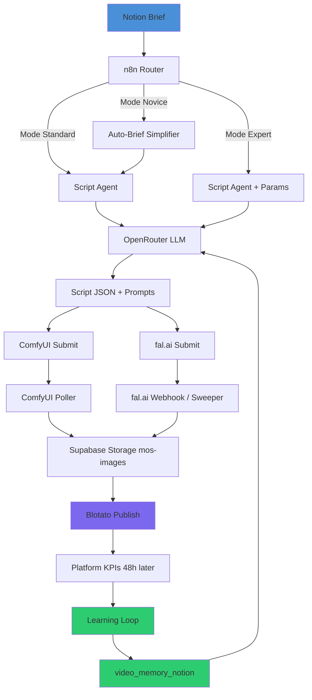

# MOS v5.0 — Architecture

## Pipeline Overview

## 3 Operating Modes

### 🟢 Novice Mode — 1 Click, 1 Video
- Fill 3 fields in Notion: Topic, Platform, Tone
- Pipeline handles everything: script, image, video, caption, hashtags, scheduling
- Approval step before publish (optional)

### 🟡 Standard Mode — Semi-Automated
- Full brief with hook, CTA, target personas
- Choose from 3 script variants generated by the agent
- Approve assets before publish
- Receive performance report 72h after

### 🔴 Expert Mode — Full Control
- Custom system prompts per video
- Model selection per job (Claude, GPT-4o, Mistral...)
- ComfyUI parameters exposed (sampler, steps, CFG)
- Budget alerts per video
- Real-time cost dashboard
- Direct SQL monitoring views

## Stack

| Layer | Technology |
|-------|-----------|
| Hub / Brief | Notion |
| Orchestration | n8n |
| LLM | OpenRouter (Claude Sonnet 4.6 default) |
| Image Generation | ComfyUI (SDXL 9:16) |
| Video Generation | fal.ai (async queue) |
| Database | Supabase / PostgreSQL |
| Storage | Supabase Storage (mos-images bucket) |
| Publishing | Blotato |
| Learning | video_memory_notion (PostgreSQL) |

## Database Schema (8 core tables)

- `clients` — Client accounts and mode preferences
- `video_production_notion` — Central video state machine
- `image_generation_queue` — ComfyUI job queue
- `fal_video_queue` — fal.ai async job queue
- `video_memory_notion` — Learning patterns (RAG source)
- `processing_locks` — Distributed lock management
- `alert_queue` — Dead-letter and human alerts
- `notion_sync_events` — Notion webhook event log
